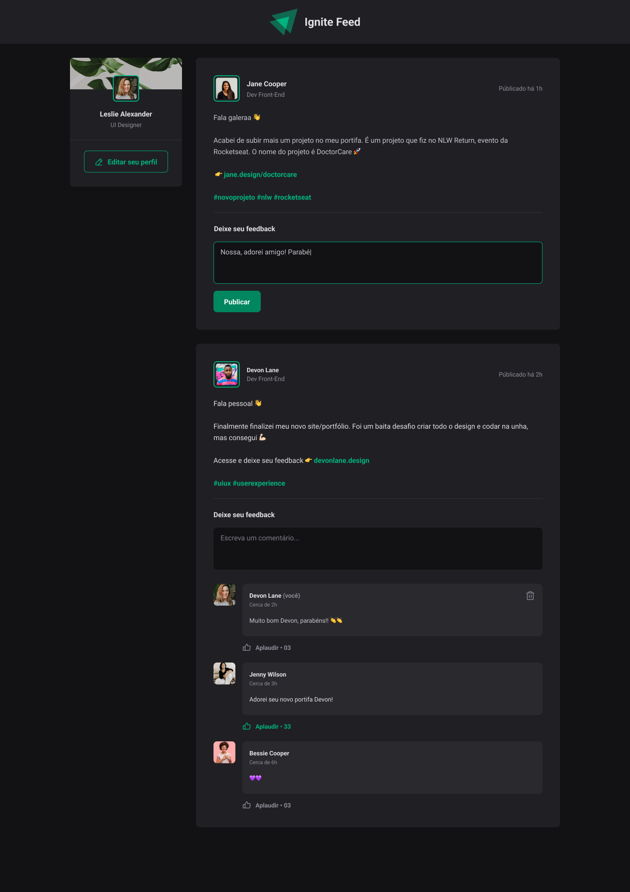

# Ignite Feed

## Description 📝
Ignite Feed is an engaging project that brings the social media experience to your fingertips. It simulates a social media feed, complete with features for adding comments, giving applause (likes), and deleting comments.

## Features 🚀
* Add comments to engage with the community 💬
* Applaud posts and comments that you love 👏
* Delete comments to maintain a positive environment 🗑️

## How to Use 🛠️
1. Clone the repository: `git clone https://github.com/codewithmiguel/ignite-feed.git`
2. Install dependencies: `yarn` or `npm i`
3. Start the local project: `yarn dev` or `npm run dev`
4. Access the project at: `http://localhost:3000/`

## Technologies Used 💻
* ReactJS - for building user interfaces
* Vite - for a faster and leaner development experience
* React Dom - for managing document object model (DOM) operations
* Date-fns - for handling dates and times
* Phosphor-react - for beautiful, hand-crafted icons

